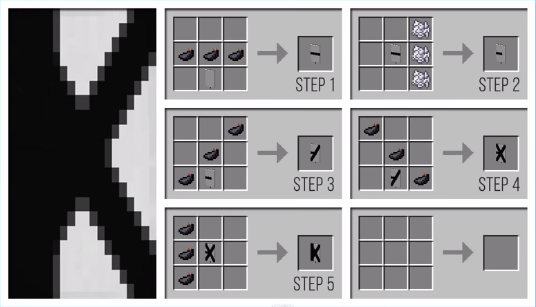

# ALPHABET BANNER IN MINECRAFT

BANNER / ESTANDARTE

 

| MATERIALS | MATERIAIS |
| ------------- | ------------- |
| WOOL  | LÃ  |
| STICK  | GRAVETO  |

 

---

A

 

---

B

---

C

---

D

---

E

---

F

---

G

---

H

---

I

---

J

---

K

---

L

---

M

---

N

---

O

---

P

---

Q

---

R

---

S

---

T

---

U

---

V

---

W

---

X

---

Y

---

Z

---
